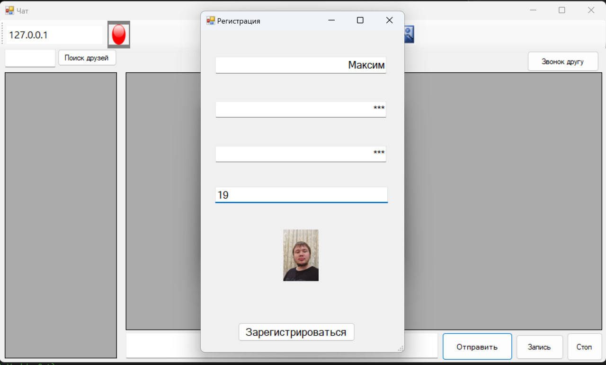
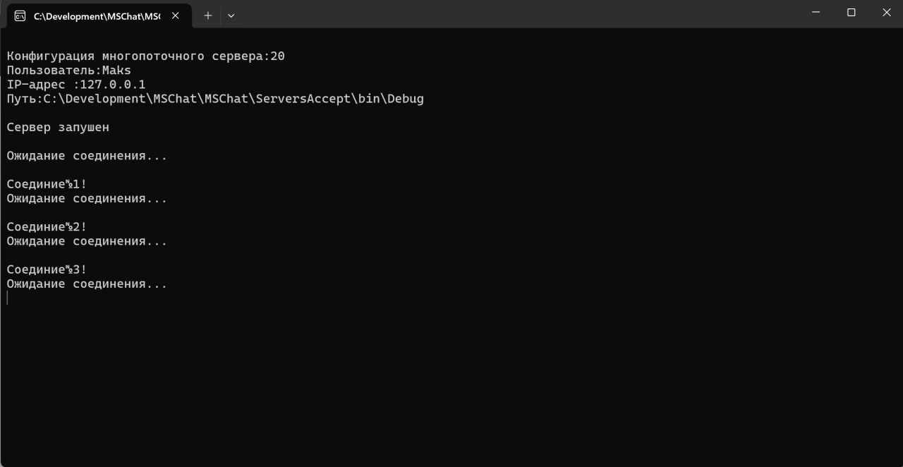
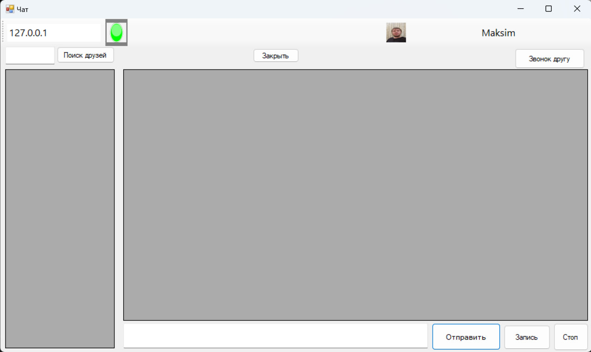
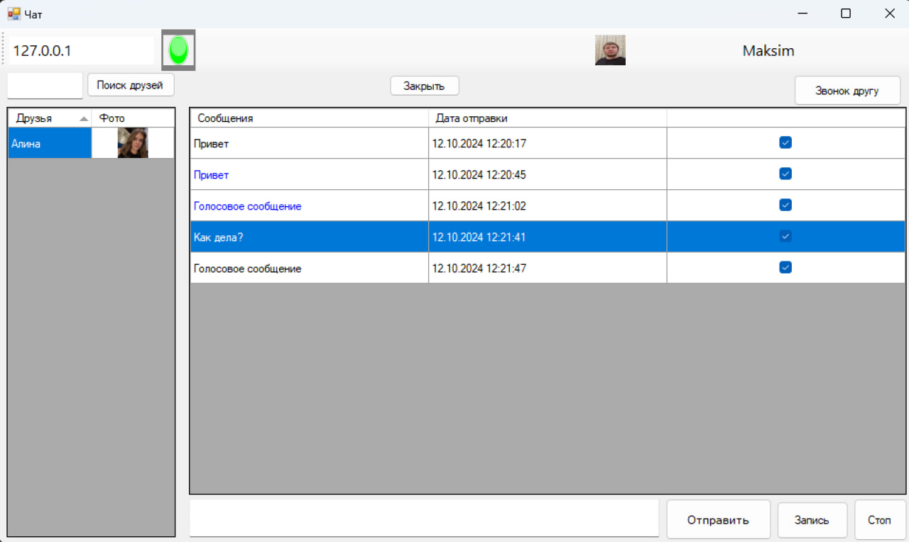
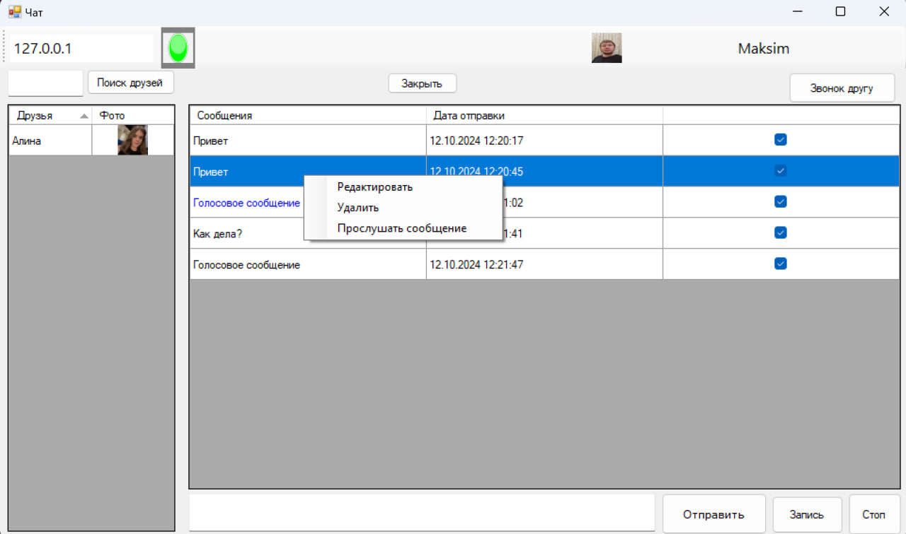

# MSChat

MSChat — это приложение для обмена сообщениями, разработанное на языке C#, которое поддерживает текстовые и аудиосообщения. Оно использует клиент-серверную архитектуру для работы в реальном времени и включает взаимодействие с Telegram Bot API для расширения функциональности. Приложение разработано с использованием многопоточности и асинхронного программирования для обеспечения эффективной обработки запросов.

## 1. Технологии

- **Язык программирования**: C#.
- **Асинхронное программирование**: Использование ключевых слов `async` и `await` для асинхронного выполнения операций, что позволяет избежать блокировок интерфейса.
- **Работа с сетью**: Применение классов `TcpClient` и `NetworkStream` для обработки сетевых подключений и передачи данных.
- **Поддержка аудиосообщений**: Пользователи могут отправлять и получать аудиосообщения, а также воспроизводить их прямо в интерфейсе.
- **JSON-сериализация/десериализация**: Использование `JsonSerializer` для работы с данными в формате JSON, что упрощает обмен данными между клиентом и сервером.

## 2. Архитектурные подходы

- **Клиент-серверная архитектура**: Приложение реализует взаимодействие между клиентом и сервером для отправки, получения сообщений и управления пользователями (например, регистрация, авторизация).
- **Многопоточность**: Сервер обрабатывает несколько подключений клиентов одновременно благодаря многопоточности и использованию пула потоков (`ThreadPool`). Асинхронные методы обеспечивают неблокирующую обработку операций.
  
## 3. Поддержка аудиосообщений

Приложение поддерживает отправку, получение и прослушивание аудиосообщений. Пользователь может записать аудиосообщение и отправить его в чат. Сообщения хранятся на сервере, и клиент может выбрать опцию для их прослушивания через контекстное меню.

## 4. Взаимодействие с внешними API

- **Telegram Bot API**: Приложение поддерживает интеграцию с Telegram через Bot API. Это позволяет пользователям отправлять сообщения через бота в Telegram и получать сообщения обратно, что значительно расширяет возможности чата.

## 5. Описание интерфейса

### Регистрация пользователя
На скриншоте ниже представлено окно регистрации нового пользователя. Пользователь может ввести свои данные: имя, пароль, возраст и загрузить фотографию для профиля. Регистрация происходит через сервер, и данные передаются по сети.

### Серверная часть
На следующем изображении отображена консольная часть работы сервера. Сервер запускается, ожидает подключений клиентов и обрабатывает их параллельно. Здесь видно, что сервер успешно принял три подключения и продолжает ожидание новых запросов.

### Основное окно чата
Третий скриншот демонстрирует основное окно приложения. После подключения к серверу пользователю отображается IP-адрес, статус подключения (отображается иконкой зелёного цвета), а также доступна возможность искать друзей и начинать звонки. Здесь также показан аватар пользователя.

### Чат с пользователем
Четвёртый скриншот демонстрирует работу чата между пользователями. Слева представлен список друзей, а справа — список сообщений. В данном примере пользователь отправил и получил как текстовые, так и аудиосообщения.

### Контекстное меню сообщений
На пятом скриншоте видно, что для каждого сообщения можно вызвать контекстное меню, через которое доступны опции редактирования, удаления и прослушивания (для аудиосообщений).

## 6. Шаблоны проектирования

- **Singleton/Статические классы**: В проекте используется большое количество статических классов и методов, таких как `Connect_Client` и `CommandCL`. Это позволяет сохранять глобальные настройки и данные, что указывает на применение паттерна Singleton.
- **Command (Команда)**: Класс `Command` используется для выполнения различных команд (например, регистрация пользователя или выборка сообщений). Это указывает на использование паттерна "Команда", где действия инкапсулируются в виде объектов.
- **Data Transfer Object (DTO)**: Классы, такие как `UserLogin` и `MsgUser_Logins`, применяются для передачи данных между клиентом и сервером, что реализует паттерн DTO.

## 7. Структура проекта

Проект включает в себя несколько ключевых компонентов:

- **Регистрация и авторизация пользователей**: Пользователи могут регистрироваться и входить в систему, используя свои логины и пароли.
- **Чат с поддержкой текстовых и аудиосообщений**: Пользователи могут отправлять текстовые и аудиосообщения, которые сохраняются на сервере.
- **Интеграция с Telegram Bot API**: Сообщения могут быть отправлены в Telegram через специального бота.
- **Многопоточная обработка**: Сервер может одновременно обрабатывать несколько подключений и запросов от различных клиентов.

---

